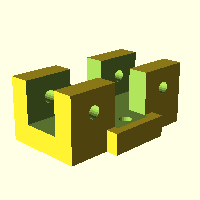
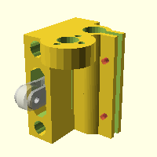
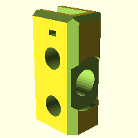
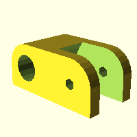
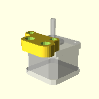
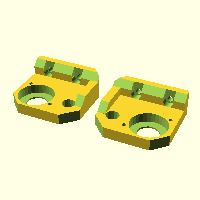
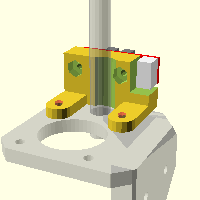

# Files

## bowden-carriage-clamp (bowden-carriage-clamp.scad)

## clamp (clamp.scad)

## effector-fan-tube (effector-fan-tube.scad)

## extruder-holder (extruder-holder.scad)

## filament-holder (filament-holder.scad)

## frame-stabalizer (frame-stabalizer.scad)

## frame (frame.scad)

## hotend-platform (hotend-platform.scad)

## x-carriage (x-carriage.scad)

## x-end-idler-tensioner (x-end-idler-tensioner.scad)

## x-end-idler (x-end-idler.scad)

## x-end-motor-nema14 (x-end-motor-nema14.scad)

## x-end-motor-nema17 (x-end-motor-nema17.scad)

## y-belt-holder (y-belt-holder.scad)

## y-corners (y-corners.scad)

## y-frame-mounts (y-frame-mounts.scad)

## y-frame-orig (y-frame-orig.scad)

## y-frame (y-frame.scad)

## y-idler (y-idler.scad)

## y-motor-nema14 (y-motor-nema14.scad)

## y-motor-nema17 (y-motor-nema17.scad)

## z-axis-bottom (z-axis-bottom.scad)

## z-axis-top (z-axis-top.scad)

## Z Endstop Holder (z-endstop-holder.scad)

