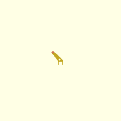
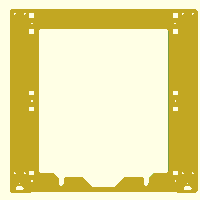
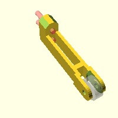
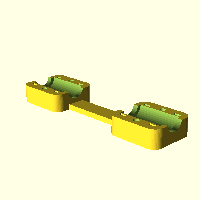
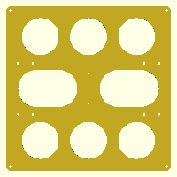
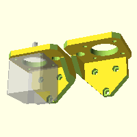

# Models

## bowden-carriage-clamp (bowden-carriage-clamp.scad)

[OpenSCAD file](./src/bowden-carriage-clamp.scad) | [STL file](./distribution/bowden-carriage-clamp.stl)

## clamp (clamp.scad)

[OpenSCAD file](./src/clamp.scad) | [STL file](./distribution/clamp.stl)

## effector-fan-tube (effector-fan-tube.scad)

[OpenSCAD file](./src/effector-fan-tube.scad) | [STL file](./distribution/effector-fan-tube.stl)

## extruder-holder (extruder-holder.scad)

[OpenSCAD file](./src/extruder-holder.scad) | [STL file](./distribution/extruder-holder.stl)

## filament-holder (filament-holder.scad)

[OpenSCAD file](./src/filament-holder.scad) | [STL file](./distribution/filament-holder.stl)

## frame-stabalizer (frame-stabalizer.scad)

[OpenSCAD file](./src/frame-stabalizer.scad) | [STL file](./distribution/frame-stabalizer.stl)

## frame (frame.scad)

[OpenSCAD file](./src/frame.scad) | [STL file](./distribution/frame.stl)

## hotend-platform (hotend-platform.scad)

[OpenSCAD file](./src/hotend-platform.scad) | [STL file](./distribution/hotend-platform.stl)

## x-carriage (x-carriage.scad)

[OpenSCAD file](./src/x-carriage.scad) | [STL file](./distribution/x-carriage.stl)

## x-end-idler-tensioner (x-end-idler-tensioner.scad)

[OpenSCAD file](./src/x-end-idler-tensioner.scad) | [STL file](./distribution/x-end-idler-tensioner.stl)

## x-end-idler (x-end-idler.scad)

[OpenSCAD file](./src/x-end-idler.scad) | [STL file](./distribution/x-end-idler.stl)

## x-end-motor-nema14 (x-end-motor-nema14.scad)

[OpenSCAD file](./src/x-end-motor-nema14.scad) | [STL file](./distribution/x-end-motor-nema14.stl)

## x-end-motor-nema17 (x-end-motor-nema17.scad)

[OpenSCAD file](./src/x-end-motor-nema17.scad) | [STL file](./distribution/x-end-motor-nema17.stl)

## y-belt-holder (y-belt-holder.scad)

[OpenSCAD file](./src/y-belt-holder.scad) | [STL file](./distribution/y-belt-holder.stl)

## y-corners (y-corners.scad)

[OpenSCAD file](./src/y-corners.scad) | [STL file](./distribution/y-corners.stl)

## y-frame-mounts (y-frame-mounts.scad)

[OpenSCAD file](./src/y-frame-mounts.scad) | [STL file](./distribution/y-frame-mounts.stl)

## y-frame-orig (y-frame-orig.scad)

[OpenSCAD file](./src/y-frame-orig.scad) | [STL file](./distribution/y-frame-orig.stl)

## y-frame (y-frame.scad)

[OpenSCAD file](./src/y-frame.scad) | [STL file](./distribution/y-frame.stl)

## y-idler (y-idler.scad)

[OpenSCAD file](./src/y-idler.scad) | [STL file](./distribution/y-idler.stl)

## y-motor-nema14 (y-motor-nema14.scad)

[OpenSCAD file](./src/y-motor-nema14.scad) | [STL file](./distribution/y-motor-nema14.stl)

## y-motor-nema17 (y-motor-nema17.scad)

[OpenSCAD file](./src/y-motor-nema17.scad) | [STL file](./distribution/y-motor-nema17.stl)

## z-axis-bottom (z-axis-bottom.scad)

[OpenSCAD file](./src/z-axis-bottom.scad) | [STL file](./distribution/z-axis-bottom.stl)

## z-axis-top (z-axis-top.scad)

[OpenSCAD file](./src/z-axis-top.scad) | [STL file](./distribution/z-axis-top.stl)

## Z Endstop Holder (z-endstop-holder.scad)
Sits on the z-axis-bottom and holds an Opto Endstop Switch

[OpenSCAD file](./src/z-endstop-holder.scad) | [STL file](./distribution/z-endstop-holder.stl)
